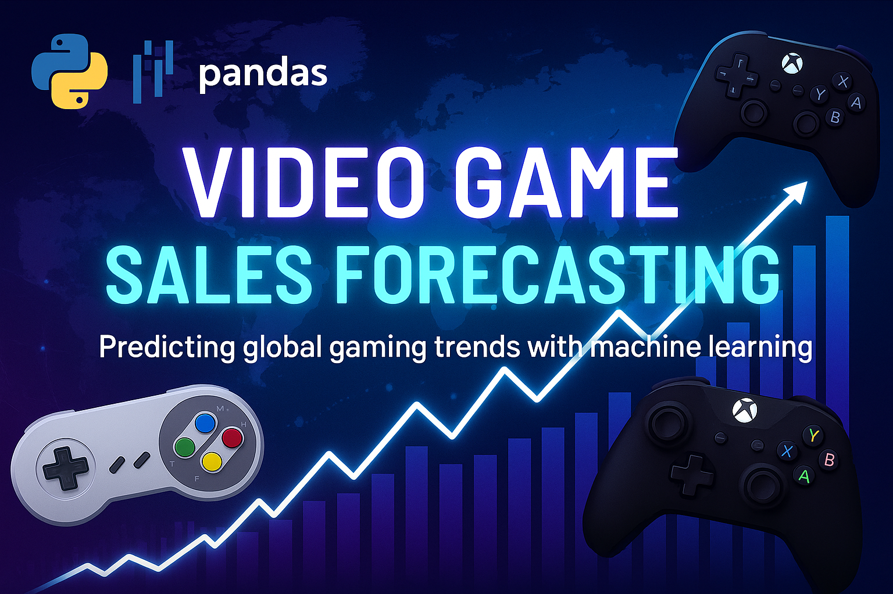

# 🎮 Video Game Sales Forecasting

This project forecasts global video game sales based on historical data, reviews, platform, and genre.

---

## 🧠 Objective

To build regression models that accurately predict 2017 video game sales using sales history and review data.

---

## 📂 Dataset

- Source: Historical global sales data
- Features: Platform, genre, critic/user scores, sales per region
- Target: Global sales for 2017

---

## 🔧 Methods Used

- Data cleaning & type conversions
- Feature engineering (platform, genre, scores)
- Time-based train-test split
- Modeling: Linear Regression, LightGBM, CatBoost
- Evaluation: RMSE

---

## 🚀 Key Results

- Final model: LightGBM
- RMSE significantly better than baseline dummy regressor
- Identified key sales drivers: platform and critic score

---

## 📌 Technologies Used

- Python, Pandas, NumPy
- Scikit-learn, LightGBM, CatBoost
- Jupyter Notebook
